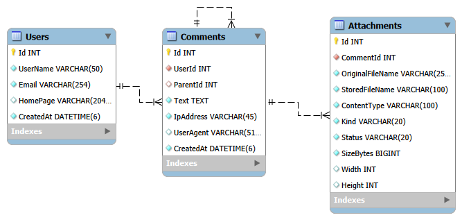

# Comments SPA

Test task for dZENcode (level **Junior+**): a single-page application where users leave comments
with unlimited nested replies, file attachments, CAPTCHA and real-time updates.

**Stack:** .NET 10 · ASP.NET Core · Entity Framework Core · PostgreSQL · Redis · RabbitMQ · SignalR · React + TypeScript (Vite) · Docker · nginx

---

## Quick start (Docker)

Requirements: **Docker** with Docker Compose, and **Git**.

```bash
git clone https://github.com/bodyastat26/dzencode-statkevych-test-task.git
cd dzencode-statkevych-test-task
docker compose up -d --build
```

Open **http://localhost:8080**.

The first build takes a few minutes (it downloads the .NET and Node images).
The database schema is created automatically on first start (EF Core migrations).

**If port 8080 is busy**, create a `.env` file next to `docker-compose.yml`:

```
WEB_PORT=8090
```

and run `docker compose up -d` again, then open http://localhost:8090.

Useful commands:

```bash
docker compose ps               # status of all services
docker compose logs -f api      # API logs (cache, queue and WebSocket events are logged)
docker compose down             # stop
docker compose down -v          # stop and delete all data
```

---

## Features

### Core requirements

| Requirement | Implementation |
|---|---|
| Comments with unlimited nested replies | `ParentId` self-reference; the whole reply tree is loaded per page and shown cascaded |
| Top-level comments as a table, sortable by User Name, E-mail, date (asc/desc) | Click the column headers |
| 25 per page, default sort LIFO | Server-side pagination, default `createdAt desc` |
| Fields: User Name (Latin letters, digits), E-mail, Home page (URL, optional), CAPTCHA, Text | Validated **on the client and on the server** with the same rules |
| CAPTCHA (image, Latin letters and digits) | Generated on the server (SkiaSharp), answer stored in Redis for 5 min, **one-time use** |
| Allowed tags `<a href title>`, `<code>`, `<i>`, `<strong>`, closing check, valid XHTML | Whitelist parser in the domain layer, covered by unit tests |
| Toolbar `[i] [strong] [code] [a]` | Wraps the selected text |
| Preview without page reload | Live preview rendered through the server sanitizer |
| Image attachment JPG/GIF/PNG, shrunk proportionally to 320×240 | Resized in a background worker via RabbitMQ |
| TXT attachment up to 100 KB | Validated on client and server |
| Visual effects when viewing files | Lightbox for images, animated modal for TXT |
| User data stored to identify the client | User (name, e-mail, home page) + IP address and User-Agent per comment |
| Protection against XSS and SQL injection | See [Security](#security) |

### Junior+ tools

| Tool | Where it is used |
|---|---|
| **Queue** | RabbitMQ queue `image-resize`: the API enqueues uploaded images, `ImageResizeConsumer` (background service) resizes them |
| **Cache** | Redis caches pages of comments (`CachedCommentService`, Decorator pattern). Invalidation by a version key |
| **Events** | In-process events `CommentCreated` and `AttachmentProcessed`; independent handlers invalidate the cache and push WebSocket notifications |
| **WebSocket** | SignalR hub `/hubs/comments`: new comments and finished images appear in all open tabs without reload (`● Live` indicator) |

Event flow when a comment with an image is posted:

```
POST /api/comments → PostgreSQL → CommentCreated event → [cache invalidated] + [WebSocket: commentCreated]
                   └→ RabbitMQ "image-resize" → resize to 320×240 → AttachmentProcessed event
                                                → [cache invalidated] + [WebSocket: attachmentUpdated]
```

---

## Architecture

```
browser ─► web (nginx: React build + reverse proxy) ─► api (ASP.NET Core) ─► PostgreSQL
                                                                         ├─► Redis
                                                                         └─► RabbitMQ
```

Only the `web` container is exposed. nginx serves the SPA and proxies `/api`, `/uploads` and `/hubs` (WebSocket) to the API.

```
src/
  Comments.Domain/          entities (User, Comment, Attachment), validation rules, HTML sanitizer — no dependencies
  Comments.Infrastructure/  EF Core, Redis cache, CAPTCHA, file storage, RabbitMQ, events
  Comments.Api/             controllers, SignalR hub, composition root
tests/
  Comments.Tests/           unit tests for the HTML sanitizer (XSS cases, tag nesting)
client/                     React + TypeScript SPA
docker/                     Dockerfiles and nginx config
docs/                       database schema (MySQL Workbench model, SQL, PNG)
```

### API

| Method | URL | Description |
|---|---|---|
| GET | `/api/comments?page=1&sortBy=createdAt\|userName\|email&sortDir=desc\|asc` | Top-level comments with reply trees, 25 per page |
| POST | `/api/comments` | Create a comment (multipart: `userName`, `email`, `homePage`, `text`, `parentId`, `captchaId`, `captchaCode`, `file`) |
| POST | `/api/comments/preview` | Sanitize text for preview, nothing is saved |
| GET | `/api/captcha` | New CAPTCHA: `{ id, image }` |
| WS | `/hubs/comments` | SignalR: `commentCreated`, `attachmentUpdated` |

---

## Security

- **XSS:** comment text goes through a whitelist parser. Only `<a>`, `<code>`, `<i>`, `<strong>` are allowed; every other character is HTML-encoded, and tags are rebuilt from scratch, never copied from input. `<a>` accepts only `href` (http/https only, so no `javascript:` links) and `title`; links get `rel="nofollow noopener noreferrer"`. Unclosed or wrongly nested tags are rejected.
- **SQL injection:** all queries go through EF Core with parameters. Sorting uses a whitelist of fields, so user input never becomes SQL.
- **Files:** the real image format is detected from the file content, not the extension. Files are stored under random names (no path traversal), served with `X-Content-Type-Options: nosniff`, and the request size is limited.
- **CAPTCHA:** one-time, expires after 5 minutes.

---

## Database schema

Implemented in **PostgreSQL** via EF Core migrations (`src/Comments.Infrastructure/Persistence/Migrations`).
For comparison with the design, the schema is also provided as:

- `docs/db-schema.mwb` — MySQL Workbench model
- `docs/db-schema.sql` — the same schema in MySQL syntax
- `docs/db-schema.png` — diagram



---

## Local development (without Docker for the app)

Requirements: .NET 10 SDK, Node.js 24, Docker.

```bash
docker compose -f docker-compose.dev.yml up -d                       # PostgreSQL (port 5433), Redis, RabbitMQ
dotnet run --project src/Comments.Api --urls http://localhost:5080   # API
cd client && npm install && npm run dev                              # SPA on http://localhost:5173
dotnet test                                                          # unit tests
```

RabbitMQ management UI: http://localhost:15672 (`comments` / `comments_dev_pwd`).

---

## Git workflow

`main` — releases · `develop` — integration · `feature/*`, `fix/*`, `docs/*`, `chore/*` — one branch per task,
merged with `--no-ff` so the branch structure stays visible in the history (`git log --graph`).

Notable fix: `fix/cache-race` — a page read that started before a cache invalidation could store stale data
under the new cache version. Now the cache key is captured before the database read.